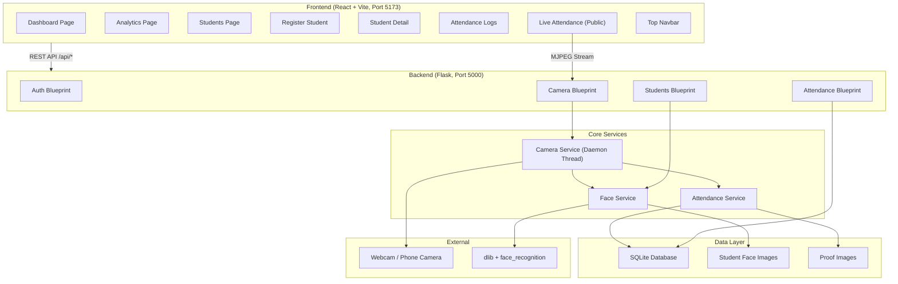
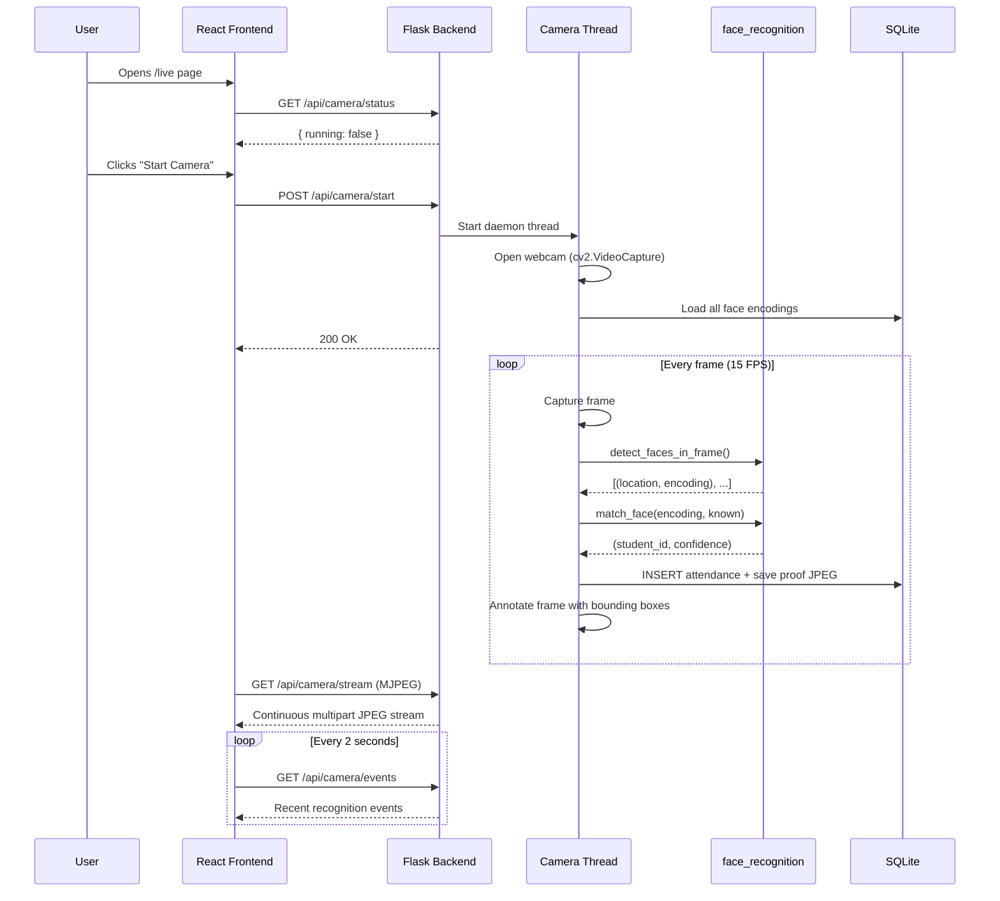
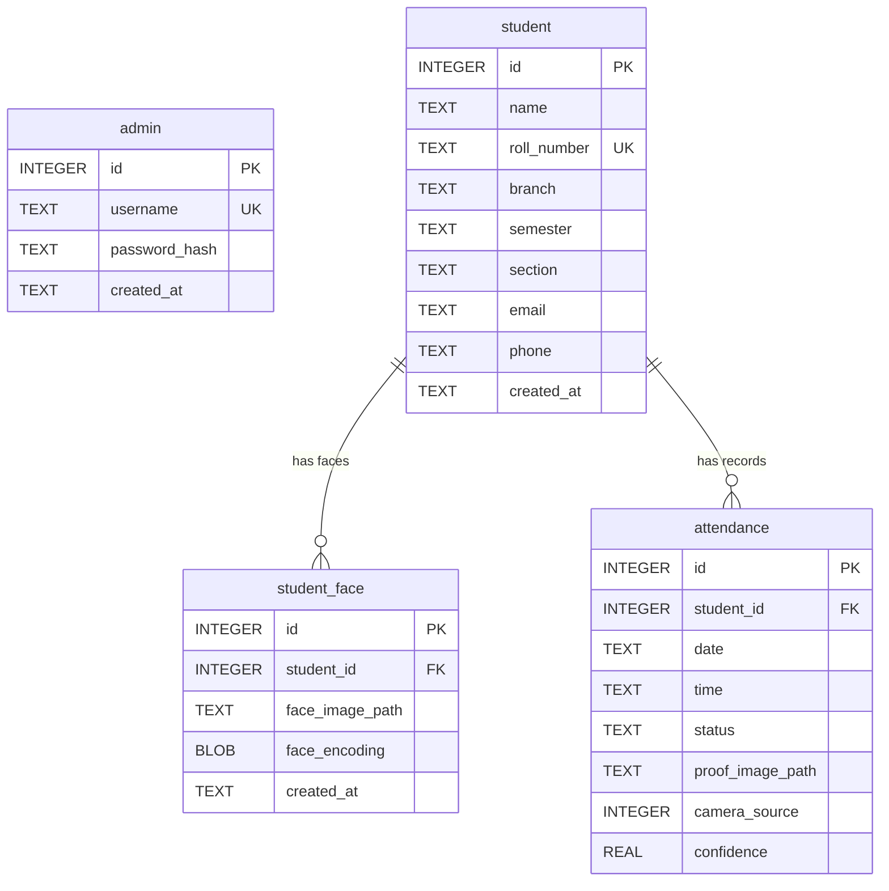
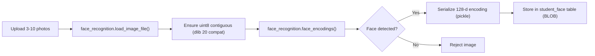
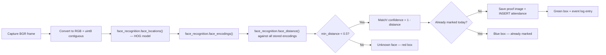

# 📋 FaceAttend — Final Project Report

**Face Recognition Attendance System**
**Repository**: [github.com/OmAgr241/face-attendance](https://github.com/OmAgr241/face-attendance)
**Date**: May 19, 2026

---

## 1. Project Overview

FaceAttend is a **full-stack college attendance system** that uses real-time face recognition to automatically identify and record student attendance. A camera (laptop webcam or phone-as-webcam via USB) detects student faces in real time, matches them against a pre-registered database, and marks attendance with photographic proof — all without any manual input.

### Key Features

| Feature | Description |
|---------|-------------|
| **Real-Time Face Detection** | Live MJPEG camera stream with OpenCV, processing every 3rd frame for performance |
| **Face Recognition** | 128-dimensional face encoding using dlib's HOG model, with configurable match threshold |
| **Automatic Attendance** | Attendance marked instantly upon face match, with deduplication (once per student per day) |
| **Proof Images** | Raw camera frame saved as JPEG proof for each attendance record |
| **Admin Dashboard** | Stat cards, modules grid, today's logs table |
| **Analytics Page** | Interactive charts — daily trend lines, per-student bar charts, section/branch pie charts |
| **Student Management** | Full CRUD with face image upload, re-encoding, and attendance history |
| **Mobile Camera Support** | Phone-as-webcam via USB (DroidCam / Iriun) with device scanning |
| **Live Attendance Kiosk** | Public-facing page (no login) for live camera display and attendance log |

---

## 2. Technology Stack

| Layer | Technology | Version |
|-------|-----------|---------|
| **Frontend Framework** | React | 19.2.6 |
| **Build Tool** | Vite | 8.0.12 |
| **Routing** | React Router DOM | 6.24.1 |
| **Charts** | Recharts | 3.8.1 |
| **HTTP Client** | Axios | 1.7.2 |
| **Icons** | Lucide React | 1.16.0 |
| **Notifications** | React Hot Toast | 2.4.1 |
| **Backend Framework** | Flask | 3.0.3 |
| **Face Recognition** | face_recognition (dlib) | 1.3.0 |
| **Computer Vision** | OpenCV | ≥ 4.10.0 |
| **Database** | SQLite 3 | Built-in |
| **Auth Hashing** | bcrypt | 4.2.0 |
| **Image Processing** | Pillow | ≥ 10.4.0 |
| **CORS** | Flask-CORS | 4.0.1 |

---

## 3. System Architecture



### Request Flow — Live Attendance



---

## 4. Database Schema



> [!IMPORTANT]
> The `attendance` table has a **UNIQUE(student_id, date)** constraint — each student can only be marked once per day, enforced at the database level.

---

## 5. API Reference

### Authentication

| Method | Endpoint | Auth | Description |
|--------|----------|------|-------------|
| `POST` | `/api/login` | ✗ | Login with username/password, returns JWT token |
| `POST` | `/api/logout` | ✓ | Invalidate session |

**Default Credentials**: `admin` / `admin123`

### Students

| Method | Endpoint | Auth | Description |
|--------|----------|------|-------------|
| `GET` | `/api/students` | ✓ | List all students with face count and attendance % |
| `POST` | `/api/students` | ✓ | Create student (supports multipart with face images) |
| `GET` | `/api/students/:id` | ✓ | Student detail with full attendance history |
| `DELETE` | `/api/students/:id` | ✓ | Delete student, their face images, and attendance |
| `POST` | `/api/students/:id/faces` | ✓ | Upload additional face images (max 10 per student) |
| `POST` | `/api/students/:id/reencode` | ✓ | Re-encode all face images (after bug fixes) |

### Attendance

| Method | Endpoint | Auth | Description |
|--------|----------|------|-------------|
| `GET` | `/api/attendance` | ✓ | Filtered attendance records (by date, student, section, branch, date range) |
| `GET` | `/api/attendance/today` | ✓ | Today's attendance records |
| `GET` | `/api/attendance/stats` | ✓ | Dashboard stats: total students, present, today's %, overall % |
| `GET` | `/api/attendance/analytics` | ✓ | Analytics data: daily trends, student rates, section/branch breakdowns |

### Camera (Public — No Auth)

| Method | Endpoint | Auth | Description |
|--------|----------|------|-------------|
| `POST` | `/api/camera/start` | ✗ | Start camera with specified index |
| `POST` | `/api/camera/stop` | ✗ | Stop camera and release resources |
| `GET` | `/api/camera/stream` | ✗ | MJPEG video stream (multipart/x-mixed-replace) |
| `GET` | `/api/camera/status` | ✗ | Camera running state and index |
| `GET` | `/api/camera/devices` | ✗ | Scan and list available camera devices |
| `GET` | `/api/camera/events` | ✗ | Last 10 recognition events |

---

## 6. Frontend Pages & Components

### Pages (7 total)

| Page | Route | Access | Description |
|------|-------|--------|-------------|
| **Live Attendance** | `/` , `/live` | Public | Camera feed, controls, real-time attendance log |
| **Login** | `/login` | Public | Admin authentication form |
| **Dashboard** | `/dashboard` | Admin | Stat cards, modules grid, today's attendance table |
| **Analytics** | `/analytics` | Admin | Charts with date/section/branch filters (lazy-loaded) |
| **Students** | `/students` | Admin | Searchable student list with attendance percentages |
| **Register Student** | `/students/new` | Admin | Multi-field form with face image upload (3–10 images) |
| **Student Detail** | `/students/:id` | Admin | Profile, face images, attendance history, re-encode |

### Components (5 total)

| Component | Description |
|-----------|-------------|
| **Navbar** | Fixed top navigation bar with nav links, analytics button, logout |
| **AttendanceTable** | Reusable attendance records table with match %, status badges, proof thumbnails |
| **CameraFeed** | MJPEG stream display with placeholder when camera is off |
| **ProofImageModal** | Full-screen modal to view proof images |
| **StudentCard** | Student profile card (used in detail view) |

---

## 7. Face Recognition Pipeline

### Enrollment Flow



### Recognition Flow (per frame)



> [!NOTE]
> **Recognition threshold** is configurable in `config.py` (`RECOGNITION_THRESHOLD = 0.5`). Lower values = stricter matching with fewer false positives.

### dlib Compatibility Patch

The app includes a **monkey-patch** in `app.py` to fix a known incompatibility between `face_recognition 1.3.0`, `dlib 20+`, and `numpy 2.x`. The patch ensures face image arrays are always contiguous uint8 before passing to dlib's `compute_face_descriptor()`.

---

## 8. Security Model

| Mechanism | Details |
|-----------|---------|
| **Password Hashing** | bcrypt with auto-generated salt |
| **Auth Token** | JWT-like token stored in `localStorage`, sent as `Bearer` header |
| **Protected Routes** | React `ProtectedRoute` wrapper redirects to `/login` if no token |
| **Backend Auth** | `@auth_required` decorator on all admin endpoints validates token |
| **401 Handling** | Axios interceptor auto-clears token and redirects on 401 responses |
| **Camera API** | Intentionally **public** (no auth) — allows kiosk mode for classrooms |
| **CORS** | Enabled for all `/api/*` routes in development |
| **Upload Limits** | 5MB per image, max 10 face images per student, 50MB total request |

---

## 9. Design System

The UI follows a **premium dark-mode design system** with the following tokens:

| Token | Value |
|-------|-------|
| **Background** | `#0d0e11` (deep charcoal) |
| **Card Surface** | `#1a1c22` |
| **Primary Accent** | `#ff5722` (electric orange) |
| **Primary Gradient** | `linear-gradient(135deg, #ff7a00, #ff5722)` |
| **Body Font** | Fira Sans |
| **Mono Font** | Fira Code |
| **Border Radius** | 6px–24px range |
| **Transitions** | 150ms–500ms cubic-bezier curves |
| **Glow Effects** | `rgba(255, 87, 34, 0.5)` box shadows |


---

## 10. Project File Structure

```
face-attendance/
├── .gitignore
├── README.md
├── image.png                          (design reference)
│
├── backend/
│   ├── app.py                         (104 lines — Flask entry, monkey-patch, blueprints)
│   ├── config.py                      (38 lines — all configurable constants)
│   ├── database.py                    (102 lines — SQLite init, table creation, admin seed)
│   ├── requirements.txt               (9 lines — Python dependencies)
│   │
│   ├── models/
│   │   ├── __init__.py
│   │   ├── admin.py                   (admin login/token queries)
│   │   ├── student.py                 (CRUD + face count + attendance %)
│   │   └── attendance.py              (200 lines — records, stats, analytics)
│   │
│   ├── routes/
│   │   ├── __init__.py
│   │   ├── auth.py                    (login/logout + @auth_required decorator)
│   │   ├── students.py                (265 lines — full CRUD + face upload + re-encode)
│   │   ├── attendance.py              (59 lines — list, today, stats, analytics endpoints)
│   │   └── camera.py                  (start/stop/stream/status/devices/events)
│   │
│   ├── services/
│   │   ├── __init__.py
│   │   ├── face_service.py            (109 lines — encoding, matching, detection)
│   │   ├── camera_service.py          (283 lines — capture loop, recognition, MJPEG stream)
│   │   └── attendance_service.py      (72 lines — mark attendance + proof saving)
│   │
│   └── storage/                       (gitignored — runtime face images & proofs)
│       ├── student_images/
│       └── proof_images/
│
└── frontend/
    ├── index.html
    ├── package.json
    ├── vite.config.js                 (API proxy to Flask :5000)
    ├── eslint.config.js
    │
    └── src/
        ├── main.jsx                   (React DOM entry)
        ├── App.jsx                    (69 lines — routing, ProtectedRoute, Toaster)
        ├── index.css                  (973 lines — complete design system)
        │
        ├── api/
        │   └── client.js              (39 lines — Axios instance with auth interceptor)
        │
        ├── pages/
        │   ├── Dashboard.jsx          (183 lines — stat cards, modules grid, today's logs)
        │   ├── Analytics.jsx          (313 lines — Recharts charts, filters, student table)
        │   ├── Login.jsx              (admin auth form)
        │   ├── Students.jsx           (138 lines — searchable student list)
        │   ├── RegisterStudent.jsx    (123 lines — registration form + face upload)
        │   ├── StudentDetail.jsx      (profile + face images + attendance history)
        │   ├── LiveAttendance.jsx     (304 lines — camera controls, MJPEG feed, event log)
        │   └── AttendanceList.jsx     (filtered attendance log with date/section/branch)
        │
        └── components/
            ├── Navbar.jsx             (232 lines — top navigation bar)
            ├── AttendanceTable.jsx    (79 lines — reusable records table)
            ├── CameraFeed.jsx         (MJPEG stream component)
            ├── ProofImageModal.jsx    (full-screen proof viewer)
            └── StudentCard.jsx        (student profile card)
```

**Estimated total lines of code**: ~3,500+ (excluding node_modules, venv, and generated files)

---

## 11. Setup & Running Instructions

### Prerequisites

- Python 3.10+ with `pip`
- Node.js 18+ with `npm`
- CMake (for compiling dlib)
- A webcam or phone camera via USB

### Backend Setup

```bash
cd face-attendance/backend
python -m venv venv
venv\Scripts\activate          # Windows
pip install cmake dlib
pip install -r requirements.txt
python app.py                  # Starts on http://localhost:5000
```

### Frontend Setup

```bash
cd face-attendance/frontend
npm install
npm run dev                    # Starts on http://localhost:5173
```

### First-Time Usage

1. Open `http://localhost:5173` — this shows the **Live Attendance** kiosk (public)
2. Click **Admin Login** → use `admin` / `admin123`
3. Go to **Register Student** → fill details + upload 3-10 face photos
4. Return to **Live Attendance** → select camera → click **Start Camera**
5. Students stand in front of the camera — attendance is marked automatically
6. Check **Dashboard** for today's stats and **Analytics** for historical charts

---

## 12. Configuration Reference

All tunable parameters are in [`backend/config.py`](backend/config.py):

| Parameter | Default | Description |
|-----------|---------|-------------|
| `RECOGNITION_THRESHOLD` | `0.5` | Face match threshold (lower = stricter) |
| `MAX_FACES_PER_STUDENT` | `10` | Maximum face images per student |
| `CAMERA_INDEX_DEFAULT` | `0` | Default camera index |
| `MAX_CAMERA_SCAN` | `5` | How many camera indices to scan |
| `STREAM_FPS_LIMIT` | `15` | Max MJPEG stream FPS |
| `FRAME_WIDTH` / `FRAME_HEIGHT` | `640×480` | Camera capture resolution |
| `JPEG_QUALITY` | `85` | Proof image JPEG quality |
| `MAX_IMAGE_SIZE_MB` | `5` | Maximum upload size per face image |
| `SECRET_KEY` | env or fallback | JWT signing key |
| `DEFAULT_ADMIN_USERNAME` | `admin` | Seeded admin account |
| `DEFAULT_ADMIN_PASSWORD` | `admin123` | Seeded admin password |

---

## 13. Known Limitations & Future Scope

### Current Limitations

- **SQLite** — single-file database, not suited for concurrent multi-user access at scale
- **HOG model** — faster but less accurate than CNN; no GPU acceleration
- **Single admin** — no multi-user or role-based access
- **No email/SMS alerts** — absent student notifications not implemented
- **Local storage only** — face images and proofs stored on disk, not cloud

### Future Enhancements

- Migrate to **PostgreSQL** for production deployment
- Add **CNN model** support for higher accuracy (with GPU)
- Implement **multi-admin** with role-based permissions
- Add **email notifications** for absent students
- Export attendance reports as **PDF/Excel**
- Deploy as **Docker container** for easy setup
- Add **anti-spoofing** (liveness detection) to prevent photo-based attacks
- Mobile app for teachers to view attendance on their phones

---

## 14. Git History

```
5f8228f  Fix attendance rate bug, remove duplicate stats, add Analytics page with charts
b9b25d0  Replace hardcoded fake metrics with real data and simplify jargon for teachers
85f53ea  Initial commit: Face Recognition Attendance System with React frontend and Flask backend
```

---

> **Project by**: Om Agrawal
> **GitHub**: [github.com/OmAgr241/face-attendance](https://github.com/OmAgr241/face-attendance)
> **Purpose**: College project — educational use
