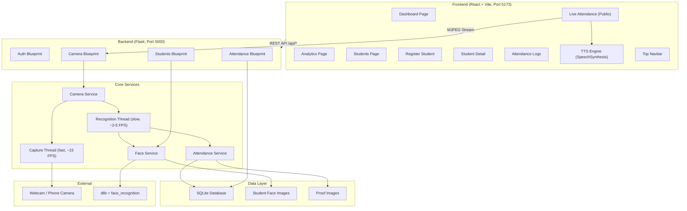
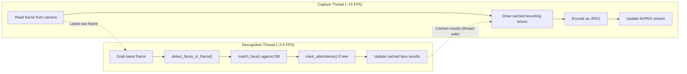
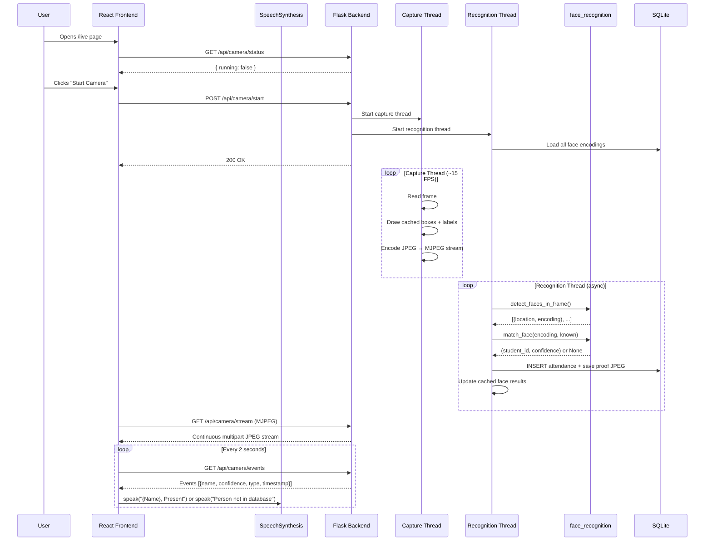
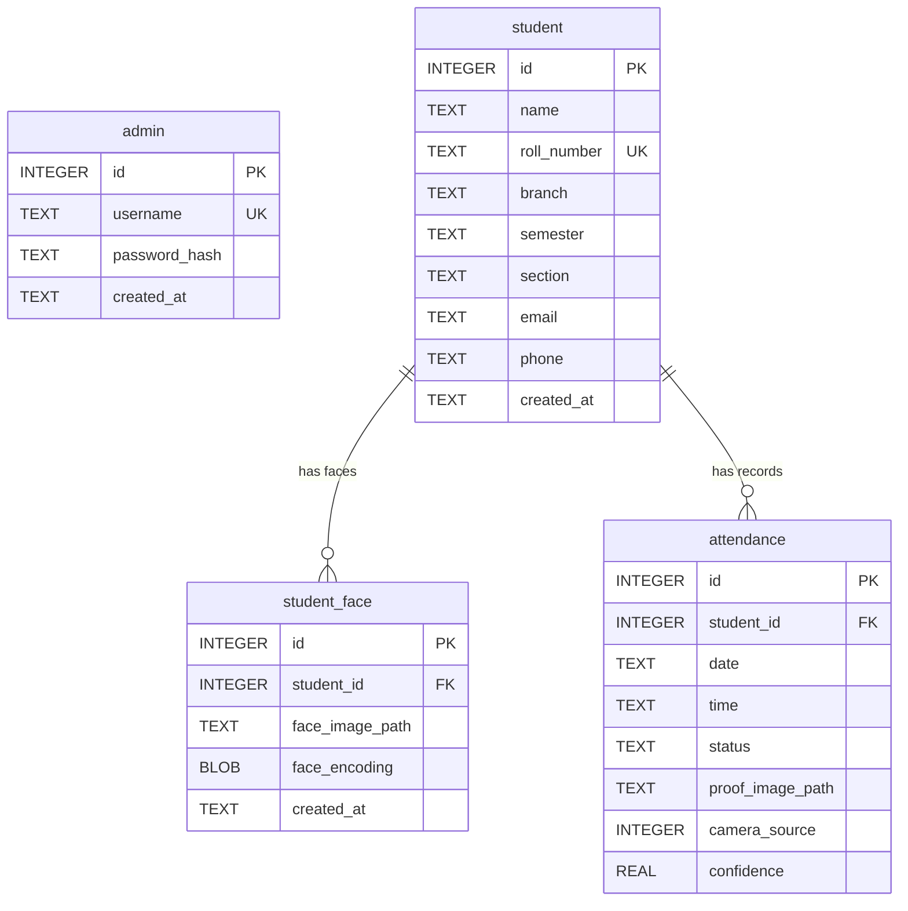
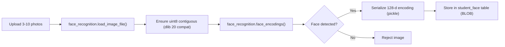
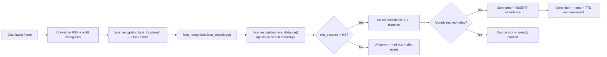

# 📋 FaceAttend — Final Project Report

**Face Recognition Attendance System**
**Repository**: [github.com/OmAgr241/face-attendance](https://github.com/OmAgr241/face-attendance)
**Date**: May 25, 2026

---

## 1. Project Overview

FaceAttend is a **full-stack college attendance system** that uses real-time face recognition to automatically identify and record student attendance. A camera (laptop webcam or phone-as-webcam via USB) detects student faces in real time, matches them against a pre-registered database, marks attendance with photographic proof, and announces recognized students via text-to-speech — all without any manual input.

### Key Features

| Feature | Description |
|---------|-------------|
| **Real-Time Face Detection** | Live MJPEG camera stream with persistent bounding boxes drawn on detected faces |
| **Face Recognition** | 128-dimensional face encoding using dlib's HOG model, with configurable match threshold |
| **Automatic Attendance** | Attendance marked instantly upon face match, with deduplication (once per student per day) |
| **Text-to-Speech (TTS)** | Browser-based SpeechSynthesis announces _"{Name}, Present"_ on recognition and _"Person not in database"_ for unknowns |
| **Mute/Unmute Toggle** | One-click toggle to silence or enable TTS announcements on the live page |
| **Unknown Person Alerts** | Red bounding box on camera feed + error toast popup + TTS warning for unrecognized faces |
| **Bounding Boxes with Names** | Green (recognized), Orange (already marked), Red (unknown) — with name labels above each box |
| **Proof Images** | Raw camera frame saved as JPEG proof for each attendance record, viewable in full-screen modal |
| **Admin Dashboard** | Stat cards (total students, present today, percentages), quick-access modules, today's attendance table |
| **Analytics Page** | Interactive Recharts charts — daily trend lines, per-student bar charts, section/branch pie charts |
| **Student Management** | Full CRUD with multi-image face upload (3–10 photos), re-encoding, and attendance history |
| **Attendance Management** | Filterable records with date ranges, branch, section filters, status toggle (Present/Absent), proof viewer |
| **Excel Exports** | Download styled daily attendance and student summary reports as `.xlsx` files |
| **Mobile Camera Support** | Phone-as-webcam via USB (DroidCam / Iriun) with automatic device scanning |
| **Live Attendance Kiosk** | Public-facing page (no login required) for live camera display and real-time attendance log |

---

## 2. Technology Stack

| Layer | Technology | Version |
|-------|-----------|---------|
| **Frontend Framework** | React | 19.2.6 |
| **Build Tool** | Vite | 8.0.12 |
| **Styling** | TailwindCSS v4 + Custom CSS | 4.3.0 |
| **Routing** | React Router DOM | 6.24.1 |
| **Charts** | Recharts | 3.8.1 |
| **Animations** | Framer Motion | 12.38.0 |
| **HTTP Client** | Axios | 1.7.2 |
| **Icons** | Lucide React | 1.16.0 |
| **Notifications** | React Hot Toast | 2.4.1 |
| **Backend Framework** | Flask | 3.0.3 |
| **Face Recognition** | face_recognition (dlib) | 1.3.0 |
| **Computer Vision** | OpenCV | ≥ 4.10.0 |
| **Database** | SQLite 3 | Built-in |
| **Auth Hashing** | bcrypt | 4.2.0 |
| **Excel Generation** | openpyxl | ≥ 3.1.0 |
| **Image Processing** | Pillow | ≥ 10.4.0 |
| **CORS** | Flask-CORS | 4.0.1 |

---

## 3. System Architecture



### Two-Thread Camera Architecture

The camera service uses a **two-thread architecture** to prevent the heavy face recognition from freezing the live MJPEG stream:



- **Capture Thread** — fast loop that reads camera frames, draws cached bounding boxes from the last recognition pass, and encodes JPEG for streaming. Never blocks.
- **Recognition Thread** — slow loop that picks up the latest frame, runs face detection and matching asynchronously, marks attendance, and atomically updates the cached face results.
- **Cached Face Results** — a thread-safe list of `(top, right, bottom, left, label, color)` tuples. The capture thread draws these on EVERY frame, so bounding boxes persist smoothly between recognition passes.

### Request Flow — Live Attendance



---

## 4. Database Schema



> [!IMPORTANT]
> The `attendance` table has a **UNIQUE(student_id, date)** constraint — each student can only be marked once per day, enforced at the database level.

---

## 5. API Reference

### Authentication

| Method | Endpoint | Auth | Description |
|--------|----------|------|-------------|
| `POST` | `/api/login` | ✗ | Login with username/password, returns UUID token |
| `POST` | `/api/logout` | ✓ | Invalidate session |

**Default Credentials**: `admin` / `admin123`

### Students

| Method | Endpoint | Auth | Description |
|--------|----------|------|-------------|
| `GET` | `/api/students` | ✓ | List all students with face count and attendance % |
| `POST` | `/api/students` | ✓ | Create student (supports multipart with face images) |
| `GET` | `/api/students/:id` | ✓ | Student detail with full attendance history |
| `DELETE` | `/api/students/:id` | ✓ | Delete student, their face images, and attendance |
| `POST` | `/api/students/:id/faces` | ✓ | Upload additional face images (max 10 per student) |
| `POST` | `/api/students/:id/reencode` | ✓ | Re-encode all face images (after bug fixes) |

### Attendance

| Method | Endpoint | Auth | Description |
|--------|----------|------|-------------|
| `GET` | `/api/attendance` | ✓ | Filtered attendance records (by date, student, section, branch, date range) |
| `GET` | `/api/attendance/today` | ✓ | Today's attendance records |
| `GET` | `/api/attendance/stats` | ✓ | Dashboard stats: total students, present, today's %, overall % |
| `GET` | `/api/attendance/analytics` | ✓ | Analytics data: daily trends, student rates, section/branch breakdowns |
| `PATCH` | `/api/attendance/:id/status` | ✓ | Toggle attendance status (Present ↔ Absent) |
| `GET` | `/api/attendance/export/daily` | ✓ | Download daily attendance as styled Excel (.xlsx) |
| `GET` | `/api/attendance/export/summary` | ✓ | Download student attendance summary as styled Excel (.xlsx) |

### Camera (Public — No Auth)

| Method | Endpoint | Auth | Description |
|--------|----------|------|-------------|
| `POST` | `/api/camera/start` | ✗ | Start camera with specified index |
| `POST` | `/api/camera/stop` | ✗ | Stop camera and release resources |
| `GET` | `/api/camera/stream` | ✗ | MJPEG video stream (multipart/x-mixed-replace) |
| `GET` | `/api/camera/status` | ✗ | Camera running state and index |
| `GET` | `/api/camera/devices` | ✗ | Scan and list available camera devices |
| `GET` | `/api/camera/events` | ✗ | Last 10 recognition events (with `type`: "recognized" or "unknown") |

---

## 6. Frontend Pages & Components

### Pages (8 total)

| Page | Route | Access | Description |
|------|-------|--------|-------------|
| **Live Attendance** | `/` , `/live` | Public | Camera feed with bounding boxes, TTS, mute toggle, event log |
| **Login** | `/login` | Public | Admin authentication form |
| **Dashboard** | `/dashboard` | Admin | Stat cards, quick-access modules grid, today's attendance table |
| **Analytics** | `/analytics` | Admin | Recharts charts with date/section/branch filters |
| **Students** | `/students` | Admin | Searchable student list with attendance percentages |
| **Register Student** | `/students/new` | Admin | Multi-field form with drag-and-drop face image upload (3–10 images) |
| **Student Detail** | `/students/:id` | Admin | Profile, face images, attendance history, re-encode |
| **Attendance List** | `/attendance` | Admin | Filterable logs with date range, branch, section, proof viewer, Excel exports |

### Components (5 total)

| Component | Description |
|-----------|-------------|
| **Navbar** | Fixed top navigation bar with nav links, analytics button, user menu |
| **AttendanceTable** | Reusable attendance records table with match %, status badges, proof thumbnails |
| **CameraFeed** | MJPEG stream display with "REC" overlay indicator and placeholder when camera is off |
| **ProofImageModal** | Full-screen modal to view proof images with student info and metadata |
| **StudentCard** | Student profile card (used in detail view) |

---

## 7. Face Recognition Pipeline

### Enrollment Flow



### Recognition Flow (per recognition cycle)



> [!NOTE]
> **Recognition threshold** is configurable in `config.py` (`RECOGNITION_THRESHOLD = 0.5`). Lower values = stricter matching with fewer false positives.

### dlib Compatibility Patch

The app includes a **monkey-patch** in `app.py` to fix a known incompatibility between `face_recognition 1.3.0`, `dlib 20+`, and `numpy 2.x`. The patch ensures face image arrays are always contiguous uint8 before passing to dlib's `compute_face_descriptor()`.

---

## 8. Live Attendance Features (v1.2)

### Text-to-Speech (TTS)
- Uses the browser's built-in **SpeechSynthesis API** — no external dependencies
- Announces _"{Name}, Present"_ when a student is recognized for the first time in a session
- Announces _"Person not in database"_ when an unknown face is detected
- Each name is spoken only once per session (deduplicated via in-memory Set)
- TTS cancels any queued speech before speaking to avoid overlap

### Mute/Unmute Toggle
- Green **"TTS ON"** button with Volume2 icon when active
- Red **"UNMUTE"** button with VolumeX icon when muted
- Muting cancels any in-progress speech immediately
- Toast notification confirms mute/unmute state

### Bounding Boxes with Names
- **Green box + name** — student recognized and attendance newly marked
- **Orange box + "Already Marked"** — student recognized but attendance already recorded today
- **Red box + "Unknown"** — face detected but not matched in database
- Boxes persist smoothly across frames via cached face results (two-thread architecture)

### Unknown Person Detection
- Unknown face events reported with **5-second cooldown** to prevent spam
- Red error toast: _"⚠ Person not in database"_ with 4-second duration
- Unknown events appear in the event log with red indicator and "NOT IN DB" badge
- TTS announces _"Person not in database"_ (respects mute toggle)

---

## 9. Excel Export System

### Daily Attendance Report
- Export filtered by date, date range, branch, section
- Styled header row with orange theme (#FF5722)
- Status column color-coded: green (Present), red (Absent)
- Auto-fitted column widths
- Filename: `daily_attendance_YYYY-MM-DD.xlsx`

### Student Attendance Summary
- Per-student summary with days present, total days, attendance %
- Percentage column color-coded: green (≥75%), orange (50-74%), red (<50%)
- Optional filter: show only students below a threshold (e.g., below 75%)
- Filename: `attendance_summary_YYYY-MM-DD_to_YYYY-MM-DD.xlsx`

---

## 10. Security Model

| Mechanism | Details |
|-----------|---------|
| **Password Hashing** | bcrypt with auto-generated salt |
| **Auth Token** | UUID token stored in `localStorage`, sent as `Bearer` header |
| **Protected Routes** | React `ProtectedRoute` wrapper redirects to `/login` if no token |
| **Backend Auth** | `@auth_required` decorator on all admin endpoints validates token |
| **401 Handling** | Axios interceptor auto-clears token and redirects on 401 responses |
| **Camera API** | Intentionally **public** (no auth) — allows kiosk mode for classrooms |
| **CORS** | Enabled for all `/api/*` routes in development |
| **Upload Limits** | 5MB per image, max 10 face images per student, 50MB total request |

---

## 11. Design System

The UI follows a **premium dark-mode design system** with the following tokens:

| Token | Value |
|-------|-------|
| **Background** | `#0d0e11` (deep charcoal) |
| **Card Surface** | `#1a1c22` |
| **Primary Accent** | `#ff5722` (electric orange) |
| **Primary Gradient** | `linear-gradient(135deg, #ff7a00, #ff5722)` |
| **Success** | `#4caf50` |
| **Danger** | `#ff5252` |
| **Body Font** | Fira Sans |
| **Mono Font** | Fira Code |
| **Border Radius** | 6px–24px range |
| **Transitions** | 150ms–500ms cubic-bezier curves |
| **Glow Effects** | `rgba(255, 87, 34, 0.5)` box shadows |

---

## 12. Project File Structure

```
face-attendance/
├── .gitignore
├── README.md
├── PROJECT_REPORT.md
├── IMPLEMENTATION_PROMPT.md               (future multi-teacher implementation guide)
│
├── backend/
│   ├── app.py                             (Flask entry, dlib monkey-patch, blueprints)
│   ├── config.py                          (38 lines — all configurable constants)
│   ├── database.py                        (102 lines — SQLite init, tables, admin seed)
│   ├── requirements.txt                   (Python dependencies)
│   │
│   ├── models/
│   │   ├── __init__.py
│   │   ├── admin.py                       (admin verification)
│   │   ├── student.py                     (CRUD + face count + attendance %)
│   │   └── attendance.py                  (389 lines — records, stats, analytics, exports)
│   │
│   ├── routes/
│   │   ├── __init__.py
│   │   ├── auth.py                        (login/logout + @auth_required decorator)
│   │   ├── students.py                    (full CRUD + face upload + re-encode)
│   │   ├── attendance.py                  (330 lines — list, stats, analytics, exports, status toggle)
│   │   └── camera.py                      (start/stop/stream/status/devices/events)
│   │
│   ├── services/
│   │   ├── __init__.py
│   │   ├── face_service.py                (109 lines — encoding, matching, detection)
│   │   ├── camera_service.py              (361 lines — two-thread capture + recognition + MJPEG)
│   │   └── attendance_service.py          (72 lines — mark attendance + proof saving)
│   │
│   └── storage/                           (gitignored — runtime images)
│       ├── student_images/
│       └── proof_images/
│
└── frontend/
    ├── index.html
    ├── package.json
    ├── vite.config.js                     (API proxy to Flask :5000)
    ├── eslint.config.js
    │
    └── src/
        ├── main.jsx                       (React DOM entry)
        ├── App.jsx                        (routing, ProtectedRoute, Toaster)
        ├── index.css                      (1198 lines — complete design system)
        │
        ├── api/
        │   └── client.js                  (39 lines — Axios instance + auth interceptor)
        │
        ├── pages/
        │   ├── Dashboard.jsx              (262 lines — stat cards, modules grid, today's logs)
        │   ├── Analytics.jsx              (375 lines — Recharts charts, filters, student table)
        │   ├── Login.jsx                  (admin auth form)
        │   ├── Students.jsx               (searchable student list)
        │   ├── RegisterStudent.jsx         (registration form + face upload)
        │   ├── StudentDetail.jsx          (profile + face images + attendance history)
        │   ├── LiveAttendance.jsx         (495 lines — camera, TTS, mute toggle, event log)
        │   └── AttendanceList.jsx         (237 lines — filtered logs, proof viewer, exports)
        │
        └── components/
            ├── Navbar.jsx                 (top navigation bar)
            ├── AttendanceTable.jsx         (reusable records table with status badges)
            ├── CameraFeed.jsx             (MJPEG stream component)
            ├── ProofImageModal.jsx         (full-screen proof viewer with metadata)
            └── StudentCard.jsx            (student profile card)
```

**Estimated total lines of code**: ~5,500+ (excluding node_modules, venv, and generated files)

---

## 13. Setup & Running Instructions

### Prerequisites

- Python 3.10+ with `pip`
- Node.js 18+ with `npm`
- CMake (for compiling dlib)
- A webcam or phone camera via USB

### Backend Setup

```bash
cd face-attendance/backend
python -m venv venv
venv\Scripts\activate          # Windows
pip install cmake dlib
pip install -r requirements.txt
python app.py                  # Starts on http://localhost:5000
```

### Frontend Setup

```bash
cd face-attendance/frontend
npm install
npm run dev                    # Starts on http://localhost:5173
```

### First-Time Usage

1. Open `http://localhost:5173` — this shows the **Live Attendance** kiosk (public)
2. Click **Admin Login** → use `admin` / `admin123`
3. Go to **Register Student** → fill details + upload 3–10 face photos
4. Return to **Live Attendance** → select camera → click **Start Camera**
5. Students face the camera — attendance is marked automatically with TTS announcements
6. Use the **Mute/Unmute** button to control TTS
7. Check **Dashboard** for today's stats and **Analytics** for historical charts
8. Go to **Attendance** → filter by date/branch/section → export as Excel

---

## 14. Configuration Reference

All tunable parameters are in [`backend/config.py`](backend/config.py):

| Parameter | Default | Description |
|-----------|---------|-------------|
| `RECOGNITION_THRESHOLD` | `0.5` | Face match threshold (lower = stricter) |
| `MAX_FACES_PER_STUDENT` | `10` | Maximum face images per student |
| `CAMERA_INDEX_DEFAULT` | `0` | Default camera index |
| `MAX_CAMERA_SCAN` | `5` | How many camera indices to scan |
| `STREAM_FPS_LIMIT` | `15` | Max MJPEG stream FPS |
| `FRAME_WIDTH` / `FRAME_HEIGHT` | `640×480` | Camera capture resolution |
| `JPEG_QUALITY` | `85` | Proof image JPEG quality |
| `MAX_IMAGE_SIZE_MB` | `5` | Maximum upload size per face image |
| `SECRET_KEY` | env or fallback | Token signing key |
| `DEFAULT_ADMIN_USERNAME` | `admin` | Seeded admin account |
| `DEFAULT_ADMIN_PASSWORD` | `admin123` | Seeded admin password |

---

## 15. Known Limitations & Future Scope

### Current Limitations

- **SQLite** — single-file database, not suited for concurrent multi-user access at scale
- **HOG model** — faster but less accurate than CNN; no GPU acceleration
- **Single admin** — no multi-user or role-based access
- **One attendance per day** — cannot track per-subject or per-period attendance
- **No email/SMS alerts** — absent student notifications not implemented
- **Local storage only** — face images and proofs stored on disk, not cloud

### Planned Enhancements (Documented)

A full implementation plan for the following features is documented in [IMPLEMENTATION_PROMPT.md](IMPLEMENTATION_PROMPT.md):

- **Multi-teacher system** — Multiple teacher accounts with role-based access (admin vs teacher)
- **Multi-branch management** — Admin-managed branches and subjects with predefined master lists
- **Per-subject attendance** — Track attendance per class group (Branch + Section + Subject)
- **Unlimited sessions** — Multiple attendance sessions per class group per day
- **Teacher dashboard** — Scoped analytics, exports, and student management per teacher
- **Class groups** — Teachers create their own class groups from admin-defined branches and subjects
- **Multi-camera support** — Multiple classroom cameras running simultaneously

### Other Future Ideas

- Migrate to **PostgreSQL** for production deployment
- Add **CNN model** support for higher accuracy (with GPU)
- Add **anti-spoofing** (liveness detection) to prevent photo-based attacks
- **Email notifications** for absent students
- Deploy as **Docker container** for easy setup
- Mobile app for teachers

---

## 16. Version History

| Version | Date | Changes |
|---------|------|---------|
| **v1.2** | May 25, 2026 | Two-thread camera architecture, TTS announcements, mute/unmute toggle, bounding boxes with persistent face tracking, unknown person detection with toast alerts, advanced attendance filtering with date ranges, proof image modal viewer, Excel export system (daily + summary), attendance status toggle |
| **v1.1** | May 22, 2026 | Attendance list improvements, proof image viewer, analytics enhancements |
| **v1.0** | May 19, 2026 | Initial release: face recognition, admin dashboard, analytics, student management, live camera |

### Git History

```
7fffc50  Update v1.2
b5dc7f7  Update v1.1
00a37b5  Add comprehensive project report (PROJECT_REPORT.md)
5f8228f  Fix attendance rate bug, remove duplicate stats, add Analytics page with charts
b9b25d0  Replace hardcoded fake metrics with real data and simplify jargon for teachers
85f53ea  Initial commit: Face Recognition Attendance System with React frontend and Flask backend
```

---

> **Project by**: Om Agrawal
> **GitHub**: [github.com/OmAgr241/face-attendance](https://github.com/OmAgr241/face-attendance)
> **Purpose**: College project — educational use
